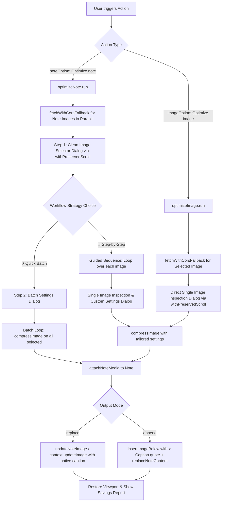

# Code Documentation — Image Compressor (`anp-24`)

## Overview

The **Image Compressor Plugin** inspects, analyzes, and optimizes images within Amplenote notes. The codebase features viewport/scroll preservation, multi-proxy CORS fallback cascades, a clean guided 2-step wizard workflow (Quick Batch vs. Step-by-Step Individual), context-aware intelligence, dynamic size presets, unit-aware size parsing (KB, MB, %), format conversion, resolution limiting, native Amplenote image caption formatting, and non-destructive audit tagging.

---

## Architecture & Data Flow

---

## Core Modules

### 1. Main Entry Point (`image-compressor.js`)
- Exposes standard Amplenote API hook points:
  - `constants`: Initial plugin runtime state (`imageCount: 0`).
  - `noteOption["Optimize note"]`: Guided 2-step workflow (`check`, `run`).
  - `imageOption["Optimize image"]`: Live image inspection and compression workflow (`check`, `run`).
  - `compressImage`: Engine method exported on the plugin root.

---

### 2. Constants & Configuration (`lib/constants.js`)
- `CORS_PROXY_URL`: Pinned HTTPS proxy for routing external media URLs.
- `DEFAULT_MAX_SIZE_KB`: Configured to `500` (derived from `ds.md` specification).
- `LIGHTWEIGHT_THRESHOLD_KB`: `150` KB threshold below which images are classified as already lightweight.
- `COMPRESSION_MODES`: `REPLACE = "replace"`, `APPEND = "append"`.
- `COMPRESSION_CONFIG`: Stepping rules (`initialQuality = 0.9`, `minQuality = 0.1`, `qualityStep = 0.1`, `scaleStep = 0.8`, `minDimension = 100`).

---

### 3. Compression Engine (`lib/compressor.js`)

#### `blobToDataUrl(blob)`
- Asynchronously converts an image `Blob` into a base64-encoded Data URL (`data:...;base64,...`) using `FileReader` with fallback to `arrayBuffer` and `btoa`.
- Guarantees full compatibility with Amplenote's `app.attachNoteMedia` API across all skip and pass-through paths (avoiding reliance on temporary or leaking `blob:` object URLs).

#### `fetchWithCorsFallback(rawUrl, primaryProxy)`
- Executes an automated fallback cascade across multiple endpoints with a 15-second `AbortController` timeout per attempt:
  1. Primary Render Proxy (`https://amplenote-plugins-cors-anywhere.onrender.com/`)
  2. Fallback Proxy (`https://corsproxy.io/?url`)
  3. Direct fetch (for local blob/data URLs or non-sandboxed environments).
- Captures explicit HTTP error status codes (e.g. `HTTP 403`, `HTTP 404`) on non-OK responses rather than swallowing them silently.
- Protects plugin execution from sandbox iframe CORS blocking and cold proxy start hangs.

#### `withPreservedScroll(imageSrc, promptAction)`
- Captures active editor container scroll offset (`scrollTop`) and anchors to the targeted image.
- Uses safe CSS selector escaping (`CSS.escape(filename)`) to prevent filenames containing parentheses, brackets, or quotes from throwing selector errors.
- Restores viewport alignment and scrolls the targeted image into center view across multiple animation frames (`0ms`, `50ms`, `200ms`, `500ms`) when modal prompts close, preventing the editor from jumping or resetting to the top of the note.

#### `insertImageBelow(content, originalSrc, newSrc, auditInfo)`
- Safely matches the target markdown image tag along with any existing caption line (`(!\[[^\]]*\]\(${escapedSrc}\)(?:\r?\n>[^\r\n]*)?)`).
- Employs non-global regex matching to avoid stateful `lastIndex` consumption between `.test()` and `.replace()`, ensuring single-occurrence images are always replaced reliably.
- Inserts the new image block with a **single newline** before the caption quote (`\n\n\n> auditInfo`).
- Strict single newline adherence guarantees Amplenote treats the quote as an attached image caption rather than an isolated blockquote.

#### `getSmartSizePresets(imageSizeBytes)`
- Generates context-appropriate size reduction profiles based on image size:
  - **Small Images ($\le 150$ KB, e.g. 31 KB)**: `50% Reduction (~16 KB)`, `75% Reduction (~8 KB)`, `Tiny Thumbnail (10 KB)`, `Custom Input`.
  - **Medium Images ($150$ KB – $600$ KB)**: `250 KB Mobile`, `100 KB Compact`, `50% Reduction`, `Custom Input`.
  - **Large Images ($> 600$ KB, e.g. 3 MB)**: Calculates exact space savings (e.g. `500 KB — 83% space saved`, `250 KB — 91% space saved`, `100 KB — 97% space saved`).

#### `getSmartDimensionLimits(currentWidth)`
- Filters resolution downscaling options to sensible caps relative to actual image width:
  - $\le 800$ px: `Keep Original` and `Max 400 px Thumbnail`.
  - $\le 1280$ px: `Keep Original`, `Max 800 px`, and `Max 400 px`.
  - $\le 1920$ px: `Keep Original`, `Max 1280 px`, and `Max 800 px`.
  - $> 1920$ px: `Keep Original`, `Max 1920 px Full HD`, `Max 1280 px`, `Max 800 px`.

#### `getSmartDefaultTarget(imageSizeBytes)`
- Computes contextual default target string (e.g. `16 KB` on a 31 KB image, `250 KB` on a 350 KB image, `500 KB` on a 3 MB image).

#### `formatBytes(bytes)`
- Formats raw byte counts into human-readable strings (`"31 KB"`, `"2.45 MB"`).

#### `parseSizeInput(input, originalSizeBytes)`
- Intelligent unit parser supporting numeric strings, KB (`500kb`), MB (`1.5mb`), and relative `%` of original size (`50%`).

#### `fetchImageMetadata(imageUrl, proxyUrl)`
- Pre-fetches the image blob via `fetchWithCorsFallback` and extracts byte size, dimensions ($W \times H$ via `createImageBitmap`), MIME type, and animated GIF status.

#### `compressImage(imageSource, targetSizeBytes, options, state)`
- Accepts a URL string or pre-fetched `Blob`.
- Checks `options.preserveGif` to prevent flattening animated GIFs, returning a valid base64 data URL.
- Automatically handles `options.format`: supports `"image/png"`, `"image/jpeg"`, or `"auto"` (which preserves PNG / WebP transparency).
- Applies `options.maxDimension` proportionally if the image exceeds the width limit.
- Checks if original image already complies with size and dimension constraints (zero-overhead bypass with data URL return).
- **Multi-Pass Loop**:
  1. Draws image to an offscreen `<canvas>` at current scale.
  2. Steps down quality from `0.9` to `0.1` (or compresses PNG iteratively).
  3. If still oversized, scales down dimensions by `scaleStep = 0.8` and repeats quality reduction.
- Updates session state image counter safely via `state.imageCount` and `DEFAULT_CONSTANTS.imageCount`.
- Returns `{ dataUrl, skipped, originalBytes, finalBytes, savingsPercent, width, height }`.

---

### 4. Note Optimizer (`lib/optimizeNote.js`)
- **Step 1 (Clean Image Selector)**:
  - Pre-fetches metadata for all images in parallel via `fetchWithCorsFallback`.
  - Renders a clean checklist of note images badged with `[Needs Optimization]` (pre-checked) vs `[Optimized]` (unchecked).
  - Offers a workflow strategy selector: `⚡ Quick Batch` vs `🎯 Step-by-Step Individual`.
- **Step 2A (Quick Batch Mode)**:
  - Opens a single global settings dialog to configure size presets, dimension caps, format, and mode for all chosen images at once.
- **Step 2B (Step-by-Step Individual Mode & Fast-Track)**:
  - Loops sequentially through selected images (or fast-tracks if only 1 image selected), opening a tailored configuration dialog for each image with its exact size and format.
- **Completion**:
  - Uploads media via `app.attachNoteMedia`.
  - In `replace` mode: calls `app.updateNoteImage(noteHandle, img, { src, caption })` updating only the specific image objects with native captions.
  - In `append` mode: calls `insertImageBelow` with `\n> Caption` and replaces note content via `app.replaceNoteContent`.
  - Delivers a comprehensive savings report with total note size before, after, skipped/failed metrics, and space saved.

---

### 5. Single Image Optimizer (`lib/optimizeImage.js`)
- **Workflow**:
  1. Implements `check(app, image)` for valid image selection under action name `"Optimize image"`.
  2. Pre-fetches metadata via `fetchWithCorsFallback` and displays live image statistics (size in bytes/KB/MB, resolution, format) in the dialog prompt.
  3. Contextualizes status header based on size:
     - Lightweight ($\le 150$ KB): `✅ Image is Already Optimized (31 KB)`.
     - Standard ($\le 500$ KB): `ℹ️ Image is Within Standard Limits (350 KB)`.
     - Large ($> 500$ KB): `⚠️ Large Image Detected (3.20 MB)`.
  4. Preserves note scroll position and anchors the viewport to the target image throughout the prompt and update cycle.
  5. Allows configuring smart presets, custom size (KB/MB/%), dimension caps, format conversions, and placement modes.
  6. Executes compression, updates native caption in-place (or appends below with `\n> Caption`), and delivers an instant savings summary.

---

## Build System

- **Bundler**: `esbuild` (`esbuild.js`)
- **Output Target**: `build/image-compressor.compiled.js`
- **Packaging Logic**: Evaluates ESM modules into a self-contained IIFE (`(() => { ... return plugin; })()`) ensuring no global namespace pollution and full compatibility with Amplenote's plugin execution sandbox.
- **Commands**:
  - `node esbuild.js 24`: Compiles bundle to `build/image-compressor.compiled.js`.
  - `node --experimental-vm-modules node_modules/jest/bin/jest.js "anp-24-image-compressor/test"`: Runs full test suite.
